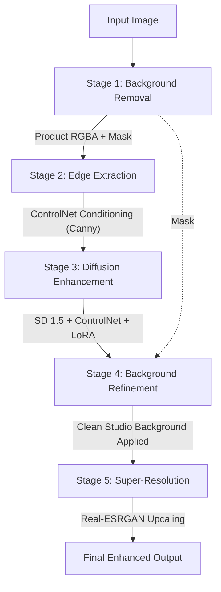

# ClearShot Architecture Documentation

## Pipeline Diagram

The ClearShot Enhancement Pipeline operates in five sequential stages to transform degraded product imagery into professional, high-fidelity studio outputs.

## Data Flow

1. **Input Stage:** The system receives a raw product image (often degraded, noisy, or poorly lit). The image size is normalized to $512 \times 512$ to match the training resolution of the base generative models and the LoRA adapter.
2. **Background Removal:** The `u2net` architecture within the `rembg` session extracts the subject, separating the foreground from the background and returning the `RGBA` format image and a binary segmentation `mask`.
3. **Edge Extraction:** The original image's object geometry is parsed using a Canny Edge Detector (with HED functionality as a fallback). The edges are mapped onto a 3-channel RGB representation that serves as the deterministic conditioning structural map for ControlNet.
4. **Diffusion Enhancement:** The original input, the extracted edge map, and user-defined (or default) prompt guidelines are fed into the Stable Diffusion 1.5 `img2img` pipeline. The fine-tuned LoRA weights specifically steer the style toward professional "studio product photography". ControlNet ensures the generative phase does not distort the structure or silhouette of the actual product.
5. **Background Refinement:** To ensure perfect transparency preservation and crisp borders, the original foreground extracted mask is re-applied over the hallucinated diffusion output. The product is then composited onto a high-quality artificial studio background (e.g. `white`, `gradient`, or simulated `studio` lighting).
6. **Super-Resolution:** Finally, the $512 \times 512$ image is fed into `Real-ESRGAN_x2plus`, scaling it to $1024 \times 1024$ resolution with sharp details and no scaling artifacts.

## Model Decisions

### U2-Net for Background Removal
We chose U2-Net (via `rembg`) because of its balance of speed and high-precision salient object border detection, outperforming semantic segmentation networks that generalize poorly to unseen objects. 

### ControlNet Conditioning over pure SD img2img
Using raw `img2img` often mutates the structural shape of the product itself or alters text/logos on products. We enforce strict adherence to the input object geography by grounding the generation via ControlNet (Canny edges).

### Stable Diffusion 1.5 instead of SDXL
SD 1.5 provides a lower GPU memory footprint, faster inference times, and extensive pre-existing tooling for LoRA adapters. Given the specific constraints of product photography constraints (clean background, sharp object, limited compositional variation), SD 1.5 achieves photorealism sufficient for Phase 5 evaluations and scales comfortably for our Gradio hosting and dataset training pipelines without hitting the extreme compute ceilings introduced by SDXL.

### Real-ESRGAN for Upscaling
Generative diffusion upscalers can occasionally hallucinate textures on generic upscaling tasks. Real-ESRGAN strikes an ideal equilibrium between fidelity retention and edge clarity for generic objects, working entirely deterministically and fast, eliminating the need to train a custom upscaling network.
